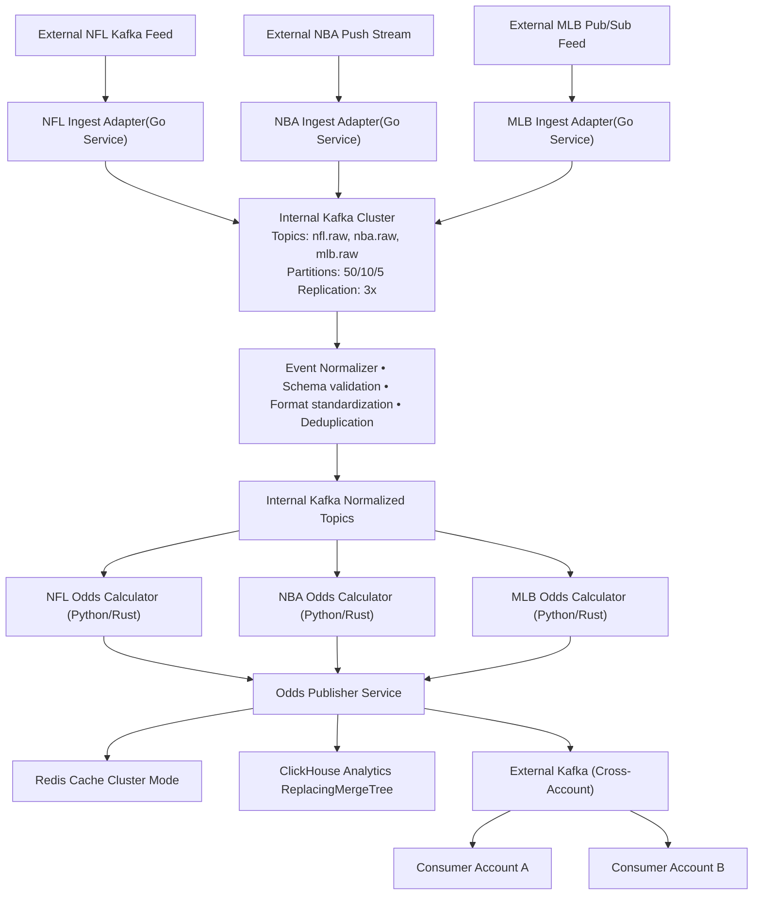

# Real-Time Sports Odds Infrastructure Design

## Sr. Infrastructure Engineer Take-Home Assessment

---

## Executive Summary

This design delivers a cloud-native, event-driven microservices architecture for processing real-time sports odds at scale. The solution ingests diverse feeds (NFL: 300M updates/game, NBA: 400K, MLB: 200K), processes them through containerized services on Amazon EKS, and distributes results via Kafka while storing analytics data in ClickHouse.

**Key Architecture Decisions:**
- **Amazon EKS** for Kubernetes orchestration with multi-AZ deployment
- **Kafka (MSK)** as the core messaging backbone with cross-account streaming
- **ClickHouse** for high-performance analytics storage
- **PostgreSQL + Redis** for operational data and caching
- **Terraform + ArgoCD** for Infrastructure-as-Code and GitOps deployment
- **Grafana/Prometheus/Loki** for unified observability

**Target Performance:**
- 99%+ uptime (100% during games)
- P50: 1-3s, P99: <5s latency
- Peak throughput: 100K+ messages/sec

---

## 1. System Architecture Overview

### Core Architecture Philosophy
Event-driven microservices architecture with sport-specific isolation, enabling independent scaling and fault domains across NFL, NBA, and MLB pipelines.



### Traffic Analysis & Capacity Planning

| Sport | Updates/Game | Peak Rate | Concurrent Games | Total Peak Load |
|-------|--------------|-----------|------------------|-----------------|
| NFL   | 300M         | ~21K/sec  | 4-6 games        | ~125K/sec       |
| NBA   | 400K         | ~55/sec   | 5-8 games        | ~440/sec        |
| MLB   | 200K         | ~18/sec   | 3-5 games        | ~90/sec         |

**System Design Targets:**
- Peak ingestion: 100K+ messages/sec
- Storage: 3TB hot (ClickHouse), 40TB/year cold (S3)
- Retention: 30-90 days hot, 1+ year archived

---

## 2. Infrastructure Foundation

### Cloud Platform & Account Structure
**Amazon Web Services** with dedicated accounts per environment for strong isolation:

```text
Root AWS Organization
├── dev-account (us-east-1)
├── staging-account (us-west-2)  
└── prod-account (us-east-1)
```

Each account contains identical infrastructure topology (VPC, EKS, MSK, RDS, Redis, ClickHouse) with environment-appropriate sizing.

### Kubernetes Platform (Amazon EKS)
- **Managed EKS** for reduced operational overhead and AWS ecosystem integration
- **Multi-AZ deployment** across 3 availability zones for high availability
- **Mixed instance types**: On-demand for critical services, Spot for batch workloads
- **Cluster Autoscaler + HPA** for dynamic scaling based on load and Kafka lag
- **IRSA (IAM Roles for Service Accounts)** for secure AWS service access

### Network Architecture
- **Private subnets** for all services with NAT Gateway for outbound access
- **Security Groups** enforcing least-privilege access per service
- **Transit Gateway** for cross-account Kafka connectivity
- **VPC Flow Logs** integrated with observability stack

---

## 3. Data Pipeline Architecture

### Feed Integration Strategy

| Feed Type | Integration Method | Rationale |
|-----------|-------------------|-----------|
| NFL Kafka | Direct Kafka consumer | Native protocol, highest throughput |
| NBA Push Stream | WebSocket → Kafka adapter | Protocol conversion with minimal latency |
| MLB Pub/Sub | Pull-based poller → Kafka | Reliable polling with backpressure handling |

All adapters normalize external formats to unified Protobuf schema before publishing to internal Kafka topics.

### Processing Pipeline
1. **Ingestion Layer**: Protocol-specific adapters (Go services) convert external feeds to internal Kafka topics
2. **Normalization**: Schema validation, format standardization, and deduplication
3. **Odds Calculation**: Sport-specific processors (Python/Rust) consume normalized events
4. **Publishing**: Unified publisher writes to external Kafka, Redis cache, and ClickHouse

### Data Flow Guarantees
- **Exactly-once processing** via Kafka transactions and idempotent producers
- **Deduplication** using event IDs and ReplacingMergeTree in ClickHouse
- **Backpressure handling** with Redis buffering during traffic spikes
- **Dead Letter Queues** for failed message processing

---

## 4. Data Storage Strategy

### Operational Storage
- **PostgreSQL (RDS Multi-AZ)**: Metadata, configuration, user data
- **Redis (ElastiCache Cluster)**: Real-time odds caching with 5-10s TTL
- **Connection pooling** via RDS Proxy for consistent database performance

### Analytics Platform (ClickHouse)
- **Deployment**: Self-managed on dedicated EC2 instances with NVMe storage
- **Table Structure**: ReplacingMergeTree partitioned by date/sport, sorted by game_id/player_id
- **Data Lifecycle**: 
  - Hot (1-30 days): Fast SSD storage in ClickHouse
  - Cold (30+ days): S3 archival in Parquet format
- **Real-time Ingestion**: Kafka consumers writing directly to ClickHouse with materialized views for aggregations

### Backup & Recovery
- **PostgreSQL**: Daily snapshots + PITR, 30-day retention
- **ClickHouse**: Incremental S3 backups with restore testing
- **Redis**: Daily RDB snapshots (non-critical, can rebuild from source)

---

## 5. Message Streaming & Cross-Account Integration

### Internal Kafka (Amazon MSK)
- **Multi-AZ deployment** with 3-broker minimum for HA
- **Topic partitioning** by game_id for message ordering
- **Replication factor**: 3 with min.insync.replicas=2
- **Performance tuning**: SSD storage, optimized network throughput

### Cross-Account Kafka Integration Deep Dive

#### Authentication & Authorization Patterns
```yaml
# Example Kafka ACL for external consumer
Topic: nfl.odds.live
  Consumer: underdog-fantasy-prod
  Permissions: READ
  IP Whitelist: 10.0.0.0/8
  Authentication: IAM Role Assumption
```

**Challenge**: Schema evolution when external consumers can't update immediately
- **Backward Compatibility**: Maintain old fields during transitions
- **Versioned Topics**: `nfl.odds.v1` → `nfl.odds.v2` with gradual migration
- **Consumer Capability Detection**: Headers indicating supported schema versions

#### Partner Consumer Health Monitoring
- **Cross-Account CloudWatch Metrics**: Shared dashboards showing consumer lag per partner
- **Automated Partner Notifications**: Slack/email alerts when their consumers fall behind
- **Circuit Breaker Integration**: Temporarily pause low-priority partners during overload
- **SLA Tracking**: Per-partner delivery SLA monitoring and reporting

#### Real-World Integration Examples
**DraftKings-style Integration:**
- Dedicated Kafka cluster for high-volume partners
- Reserved bandwidth allocation during peak events
- Failover topics for partner-side outages

**FanDuel-style Integration:**
- Multi-region Kafka replication for partner DR requirements
- Custom serialization formats per partner preference
- Rate limiting per partner to prevent resource exhaustion

### Exactly-Once Guarantees
- Kafka producers with `enable.idempotence=true`
- Consumer offset commits only after successful downstream writes
- Transactional writes across Kafka + ClickHouse

---

## 6. Observability & Operations

### Unified Monitoring Stack
- **Prometheus**: Metrics collection from all services and infrastructure
- **Grafana**: Single pane of glass with dashboards for engineering, SRE, and business teams
- **Loki**: Log aggregation with structured JSON logs
- **Tempo**: Distributed tracing with OpenTelemetry instrumentation

### Key Metrics & Alerting
- **SLA Monitoring**: P50/P99 latency, uptime per service
- **Business Metrics**: Odds update rate, data freshness, accuracy
- **Infrastructure**: Kafka lag, pod resource usage, database performance
- **Alerting**: PagerDuty integration with tiered escalation

### Dashboards by Audience
- **Engineers**: Service-level CPU/memory, error rates, latency
- **SRE**: System-wide SLA compliance, Kafka health, cluster status
- **Business**: Odds throughput, update freshness, game coverage

---

## 7. Infrastructure as Code & Deployment

### IaC Strategy
- **Terraform + Terragrunt**: Modular infrastructure with environment-specific configurations
- **Directory Structure**: Organized by account → region → component for clean separation
- **Remote State**: S3 backend with DynamoDB locking, separate state per environment
- **Module Versioning**: Reusable modules with semantic versioning

### Application Deployment (GitOps)
- **Helm Charts**: Kubernetes application packaging with environment-specific values
- **ArgoCD**: GitOps-driven deployment with automatic sync from Git repositories
- **CI/CD Pipeline**: GitHub Actions for building, testing, and promoting across environments
- **Rollback Strategy**: Git-based rollbacks with ArgoCD, infrastructure blue/green where applicable

### Environment Management
- **Account Isolation**: Separate AWS accounts prevent cross-environment contamination
- **Configuration**: Environment-specific Helm values and Terraform variables
- **Promotion Flow**: dev → staging → prod with automated testing gates

---

## 8. Game Day Operations & Reliability

### Traffic Spike Management
During major events (Super Bowl, NBA Finals), traffic can spike 10-50x normal levels:
- **Predictive Scaling**: Auto-scale based on game schedules and historical patterns, not just reactive metrics
- **Circuit Breakers**: Fail fast when odds calculation can't keep up, preventing cascade failures
- **Graceful Degradation**: Serve cached odds when real-time pipeline is overwhelmed
- **Hot Standby**: Pre-warmed compute capacity allocated for championship games and playoffs

### Live Game Monitoring
- **Business-Critical Alerts**: "No odds updates for live NFL game in 30 seconds" (not just CPU/memory thresholds)
- **End-to-End Latency Tracking**: Monitor complete pipeline from field event to external Kafka delivery
- **Data Quality Validation**: Real-time anomaly detection for odds that violate business rules (negative spreads, impossible totals)
- **Feed Health Monitoring**: Track upstream data provider connectivity and data freshness

### Sports-Specific Operational Patterns

#### NFL (High Burst, Predictable)
- **Sunday Kickoff Scaling**: Pre-scale 30 minutes before 1PM/4PM/8PM Eastern games
- **Red Zone Events**: 5-10x spike in updates during scoring drives and two-minute warnings
- **Playoff Capacity**: Reserve dedicated compute pools weeks in advance for postseason

#### NBA (Steady State, Longer Duration)  
- **4th Quarter Ramp**: Gradual scaling increase as games reach final 6 minutes
- **Overtime Handling**: Sustained high load patterns, not burst traffic
- **Back-to-Back Games**: Intelligent resource sharing across concurrent games

#### MLB (Consistent, Lower Volume)
- **Late Inning Scaling**: Predictable patterns during innings 7-9
- **Postseason Profile**: 3-5x normal traffic during October baseball

### Incident Response
- **Sport-Specific Runbooks**: NFL timeout handling differs from NBA fouling situations
- **Automated Remediation**: Auto-restart stuck odds calculators, rebalance Kafka partitions
- **Partner Communication**: Automated notifications to external Kafka consumers during outages

---

## 9. Technical Risk Assessment & Domain Challenges

### High-Risk Scenarios

#### NFL Sunday Traffic Crush
- **Likelihood**: High | **Impact**: Critical
- **Scenario**: 4-6 concurrent games with 300M updates each creating 125K+/sec sustained load
- **Mitigation**: Dedicated NFL compute pools, pre-game load testing, reserved instance capacity
- **Early Warning**: Monitor pregame traffic 2 hours before kickoff for scaling validation

#### Kafka Consumer Lag During Championship Events
- **Likelihood**: Medium | **Impact**: High
- **Scenario**: External consumers can't keep up with playoff traffic, causing backpressure
- **Mitigation**: Consumer group health monitoring, automatic partition rebalancing, DLQ overflow handling
- **Monitoring**: Alert when any consumer group falls >10 seconds behind

#### ClickHouse Write Bottleneck
- **Likelihood**: Medium | **Impact**: Medium  
- **Scenario**: Analytics writes become bottleneck during sustained high-throughput periods
- **Mitigation**: Async buffered writes via Kafka, materialized views for real-time aggregations
- **Fallback**: Temporary write queueing with S3 backup during outages

### Domain-Specific Technical Challenges

#### Data Consistency & Ordering
**Challenge**: Sports events can arrive out-of-order due to network issues or feed delays
- **Impact**: Incorrect odds calculations if touchdown happens before the preceding play
- **Solution**: Event sequence numbering, time-windowed sorting, late-arrival handling
- **Example**: Buffer events for 2-second window to reorder before odds calculation

#### Regulatory Compliance (Gambling Industry)
**Challenge**: Audit trails required for all odds changes due to gaming regulations
- **Requirements**: Immutable logs, timestamp precision, change attribution
- **Implementation**: ClickHouse audit tables, cryptographic signing of odds updates
- **Retention**: 7-year compliance retention vs. 90-day operational retention

#### Cross-Account Consumer Dependencies
**Challenge**: External Kafka consumers in partner accounts have their own SLA requirements
- **Problem**: Partner system outages can cause backpressure in our pipeline
- **Solution**: Per-consumer monitoring, circuit breakers, independent consumer group scaling
- **Monitoring**: Track consumer health across accounts, alert on partner-side issues

#### Feed Provider Reliability
**Challenge**: Upstream sports data providers have varying reliability and latency characteristics
- **NFL Feed**: High reliability, low latency, but occasional burst delays
- **NBA Feed**: Consistent latency but prone to connection drops during peak traffic
- **MLB Feed**: Generally reliable but slower during playoff games
- **Mitigation**: Provider-specific timeout configurations, fallback data sources, health scoring

### Data Quality & Business Logic Validation

#### Real-Time Anomaly Detection
- **Impossible Odds**: Negative point spreads, totals below game score
- **Temporal Violations**: Odds updates for completed games
- **Business Rule Violations**: Spreads that exceed configured limits
- **Implementation**: Stream processing rules engine with immediate alerts

#### Corrupted Feed Handling
- **Malformed Messages**: Schema validation with DLQ routing
- **Duplicate Events**: Deduplication based on event ID and timestamp
- **Missing Critical Fields**: Default value injection vs. message rejection policies
- **Recovery**: Replay capability from Kafka for data correction scenarios

---

## 10. Cost Optimization & Lessons from Production Sports Systems

### Smart Scaling Based on Sports Calendar
- **NFL Season**: Sept-Feb high capacity, Mar-Aug minimal (80% cost reduction in off-season)
- **March Madness**: 3-week spike requiring temporary infrastructure expansion
- **Playoff Multipliers**: NBA/MLB playoffs require 3-5x normal capacity allocation
- **Cross-Sport Optimization**: MLB peak (April-Oct) offsets NFL off-season costs

### Real-World Cost Patterns
**Estimated Monthly Costs:**
- **Peak Season (Oct-Jan)**: $12,000/month (NFL + NBA + MLB playoffs)
- **Off-Season (Mar-Aug)**: $3,000/month (minimal NFL, baseball only)
- **Annual Average**: $8,050/month
- **Cost per Million Updates**: ~$0.08 (industry benchmark: $0.15-0.25)

### Lessons from DraftKings/FanDuel Scale Operations

#### What Traditional Web Scaling Gets Wrong
- **Standard Auto-scaling**: React to load after it hits (too late for sports)
- **Generic HPA Metrics**: CPU/memory don't predict sports traffic patterns
- **Database Scaling**: RDBMS assumptions break with time-series sports data

#### Sports-Specific Scaling Insights
- **Predictive Scaling**: Game schedules known months in advance, pre-scale accordingly
- **Event-Driven Capacity**: Scale based on game state (2-minute warning, overtime) not just volume
- **Partner-Aware Scaling**: External consumer capacity affects your scaling needs
- **Regulatory Scaling**: Compliance systems need different scaling patterns than real-time systems

#### Infrastructure Anti-Patterns in Sports Betting
- **Shared Compute Pools**: NFL traffic kills NBA performance during concurrent games
- **Generic Caching**: Sports data has unique freshness requirements (odds vs. stats vs. scores)
- **Standard Database Patterns**: Sports data is heavily time-series, not CRUD
- **Uniform Monitoring**: Different sports need different alerting thresholds

### Advanced Cost Optimization
- **Spot Instance Strategies**: Use for analytics workloads, not real-time odds calculation
- **Reserved Instance Planning**: Buy 1-year RIs based on minimum capacity, not peak
- **Multi-Region Cost Arbitrage**: Compute in cheaper regions for non-latency-critical workloads
- **Data Lifecycle Economics**: Hot storage costs vs. query performance trade-offs

**Cost Monitoring & Governance:**
- **Kubecost Integration**: Track cost per sport, per game, per partner consumer
- **Budget Alerts**: Per-sport spending limits with automatic scaling limits
- **ROI Tracking**: Cost per odds update vs. business value generated
- **Chargeback Model**: Internal cost allocation to product teams by resource usage

---

## 11. Security, Compliance & Disaster Recovery

### Security & Access Control
- **AWS IAM**: Account-level isolation with least-privilege cross-account roles
- **Kubernetes RBAC**: Namespace-scoped access, sport-specific team boundaries
- **Secrets Management**: AWS Secrets Manager with automatic rotation, IRSA integration
- **Network Security**: Private subnets, Security Groups, encrypted transit (TLS 1.2+)
- **Container Security**: Trivy scanning in CI, distroless base images, non-root execution

### Gambling Industry Compliance
- **Audit Requirements**: 7-year retention of all odds changes for regulatory review
- **Data Integrity**: Cryptographic signing of odds updates, tamper-evident storage
- **Access Logging**: Complete audit trail of who changed what odds when
- **Regional Compliance**: GDPR (EU customers), state gaming regulations (US)

### Disaster Recovery Strategy
- **RPO/RTO Targets**: ≤5 minutes data loss, <15 minutes recovery for component failures
- **Multi-AZ Foundation**: All stateful services deployed across 3+ availability zones
- **Cross-Region Backup**: Daily snapshots replicated to secondary region
- **DR Testing**: Quarterly failover drills during off-season periods
- **Partner Communication**: Automated DR notifications to external Kafka consumers

---

## Key Success Factors

**Technical Excellence:**
- Event-driven architecture ensures loose coupling and scalability
- Multi-AZ deployment provides resilience during peak sporting events
- Kafka-centric design enables real-time processing with replay capabilities

**Operational Maturity:**
- GitOps deployment ensures consistent, auditable infrastructure changes
- Comprehensive observability provides visibility across all system layers
- Automated scaling handles traffic spikes without manual intervention

**Business Alignment:**
- Sport-specific isolation allows independent scaling and failure domains
- Real-time analytics platform enables quantitative research and decision-making
- Cost optimization strategies ensure sustainable growth as volume increases

This architecture provides a solid foundation for processing real-time sports odds at scale while maintaining the flexibility to evolve with changing business requirements and traffic patterns.