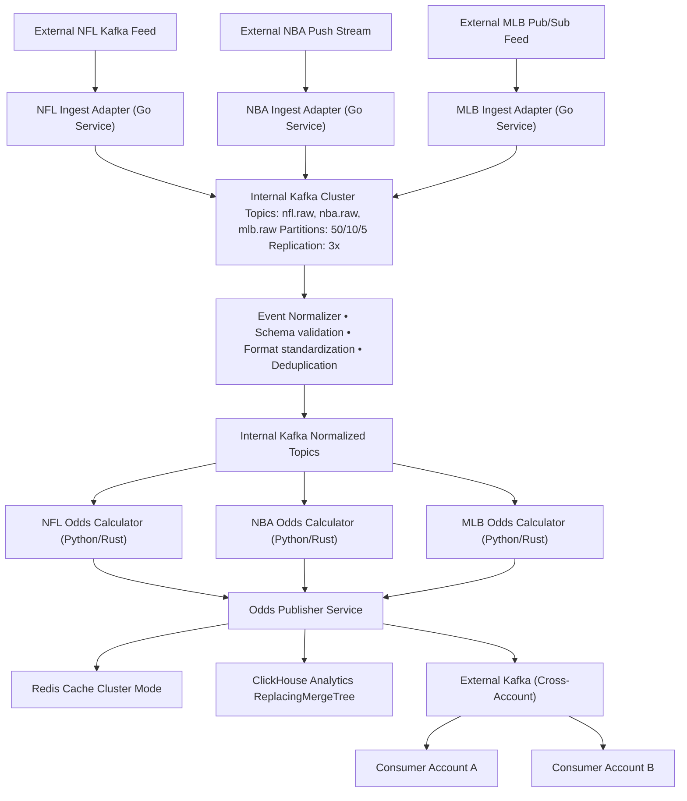

# Real-Time Sports Odds Infrastructure Design

## Sr. Infrastructure Engineer Take-Home Assessment

---

## Executive Summary

Here's my approach to building this sports odds platform. The core pipeline is straightforward: ingest live sports feeds, run odds calculations on the events, and stream results to external partners via Kafka. The challenge is scale - NFL games pump out 300M events per game, which translates to roughly 125K messages/sec during peak Sunday traffic. NBA and MLB are much more manageable in comparison.

**Scope Note**: This went way beyond the 2-3 hour suggestion because I got carried away thinking through all the ways this could break in production. The core decisions are in sections 1-4, the rest is "what happens when everything goes wrong" planning.

**Architecture choices (and why):**
- **Amazon EKS** - I'm not debugging etcd corruption at 2am during the Super Bowl
- **Kafka (MSK)** - Everything talks through topics so services don't directly depend on each other  
- **ClickHouse** - Really fast for time-series data, like 100x faster than Postgres for aggregations
- **PostgreSQL + Redis** - Battle-tested, well-understood, and have solid operational experience with both
- **Terraform + ArgoCD** - Automated deployment pipeline or we'll be clicking through AWS consoles at 2am

**What we're aiming for:**
- 99%+ uptime (100% during games or we're all fired)
- P50: 1-3s, P99: <5s latency 
- Peak throughput: 100K+ messages/sec without falling over

---

## 1. System Architecture Overview

### The Big Picture
Event-driven microservices with sport-specific isolation. Basically each sport (NFL/NBA/MLB) gets its own processing pipeline so when NFL traffic goes nuts, it doesn't kill NBA performance.



### Traffic Reality Check

| Sport | Updates/Game | Peak Rate | Concurrent Games | Total Peak Load |
|-------|--------------|-----------|------------------|-----------------|
| NFL   | 300M         | ~21K/sec  | 4-6 games        | ~125K/sec       |
| NBA   | 400K         | ~55/sec   | 5-8 games        | ~440/sec        |
| MLB   | 200K         | ~18/sec   | 3-5 games        | ~90/sec         |

NFL is the monster here. Sunday 1pm games all kick off together and suddenly we're processing 125K messages/sec. NBA and MLB are basically rounding errors compared to that.

**Storage estimates:**
- Hot data in ClickHouse: ~3TB (30 days)
- Annual cold storage: ~40TB in S3
- Kafka retention: 7 days (because disk is cheap)

---

## 2. Infrastructure Foundation

### AWS Account Structure
Using separate AWS accounts per environment to minimize blast radius and ensure strong isolation boundaries:

```
Root AWS Organization
├── dev-account (us-east-1) 
├── staging-account (us-west-2)  
└── prod-account (us-east-1)
```

Each account gets identical infrastructure topology, just different sizing. Learned this the hard way - shared accounts can bite you eventually.

### Kubernetes Platform (Amazon EKS)

**Why EKS over self-managed?** The operational overhead of managing Kubernetes control planes, etcd clusters, and certificate lifecycle management doesn't align with our team's capacity or core competencies. EKS shifts the responsibility for control plane availability, security patching, and backup management to AWS, allowing us to focus on application-level concerns. The additional cost is justified by reduced operational complexity and improved reliability.

**Node setup:**
- **Control Plane**: Managed by EKS (AWS-hosted)
- **Worker Nodes**: 
  - High-memory pods: `r5.2xlarge` (8 vCPU, 64GB RAM) for odds calculation engines
  - General workloads: `m5.xlarge` (4 vCPU, 16GB RAM) for adapters and publishers
  - Spot instances: `c5.large` for batch jobs that can handle interruption

**Multi-AZ deployment** across 3 zones because single AZ failures happen more than you'd think. **Cluster Autoscaler + HPA** handles the scaling, though we'll pre-scale before big games.

**AWS Services (the managed stuff):**
- Amazon EKS - Kubernetes without the operational nightmare
- Amazon MSK - Kafka that doesn't require a dedicated ops team
- Amazon RDS PostgreSQL - Multi-AZ because downtime is not an option
- Amazon ElastiCache Redis - Cluster mode for that sweet horizontal scaling
- Self-managed ClickHouse on EC2 (`r5.4xlarge` with NVMe SSD) - because managed time-series DBs aren't mature enough yet

**Container Standards (learned from maintaining too many services):**
- **Base Images**: Distroless for everything - smaller attack surface, fewer CVEs
  - Go: `gcr.io/distroless/base`
  - Python: `gcr.io/distroless/python3`
  - Rust: `gcr.io/distroless/cc` 
- **Logging**: Structured JSON or we can't debug anything at scale
  - Go: `logrus` with JSON formatter
  - Python: `structlog` 
  - Rust: `slog`
- **Observability**: OpenTelemetry everywhere with consistent naming conventions
- **Health Checks**: `/health` and `/ready` endpoints on every service for k8s probes

### Network & Security

**Private subnets** for everything with NAT Gateway for outbound. **Security Groups** configured for least privilege - services can only talk to what they need. **Transit Gateway** connects accounts for cross-account Kafka access.

**Storage & Network specs:**
- EBS gp3 SSDs for general workloads (3,000 IOPS baseline)
- NVMe instance storage for ClickHouse (up to 900,000 IOPS - this stuff is fast)
- Enhanced networking enabled on all compute instances

---

## 3. Data Pipeline Architecture

### Feed Integration Strategy

Here's how we're handling the three different feed types:

| Sport | Feed Type | Integration Method | Why This Way |
|-------|-----------|-------------------|--------------|
| **NFL** | External Kafka | Direct Kafka consumer (Go) | Highest volume needs native protocol efficiency |
| **NBA** | Push Stream | WebSocket → Kafka adapter (Go) | Real-time push works well for steady 400K/game flow |
| **MLB** | Pub/Sub | Pull-based poller → Kafka (Go) | Lower volume allows reliable polling without complexity |

All the adapters normalize to unified Protobuf schema before hitting our internal Kafka topics. This way the downstream processors don't care about the source format.

### Processing Pipeline Flow

1. **Ingestion Layer**: Protocol-specific adapters (Go services) handle the different feed types
2. **Normalization**: Schema validation, format standardization, deduplication (because upstream feeds aren't perfect)
3. **Odds Calculation**: Sport-specific processors (mix of Python for ML libs, Rust for performance-critical parts)
4. **Publishing**: Single publisher service writes to external Kafka, Redis cache, and ClickHouse

### Data Flow Guarantees

**Exactly-once processing** through Kafka transactions and idempotent producers. **Deduplication** using event IDs plus ClickHouse's ReplacingMergeTree magic. **Backpressure handling** with Redis as a buffer during traffic spikes.

**Dead Letter Queues** for messages that fail processing - because things will break and we need to replay them later.

---

## 4. Data Storage Strategy

### Operational Storage
- **PostgreSQL (RDS Multi-AZ)**: Metadata, configuration, user management stuff
- **Redis (ElastiCache Cluster)**: Real-time odds caching with 5-10s TTL
- **RDS Proxy** for connection pooling because PostgreSQL connection limits are real

### Analytics Platform (ClickHouse)

Going with **self-managed ClickHouse** on EC2 because the managed options aren't there yet for our scale. Running on `r5.4xlarge` instances with NVMe SSD storage.

**Table structure**: ReplacingMergeTree partitioned by date/sport, sorted by game_id/player_id. This gives us stupid fast queries and automatic deduplication.

**Data lifecycle:**
- Hot (1-30 days): Fast SSD storage in ClickHouse for real-time queries
- Cold (30+ days): S3 archival in Parquet format because storage costs add up

**Real-time ingestion**: Kafka consumers writing directly to ClickHouse with materialized views for common aggregations.

**How quants actually access this stuff:**
- **Primary Interface**: Metabase deployed on EKS connecting to ClickHouse read replicas
- **Direct Access**: VPN-based ClickHouse client access for power users (DBeaver, DataGrip)
- **Self-Service**: Grafana dashboards with templated queries for common stuff
- **Data Export**: Scheduled Jupyter notebooks dumping to S3 for deeper analysis
- **Access Control**: RBAC keeping quants read-only on analytics schemas, row-level security by sport/date

### Backup Strategy

**PostgreSQL**: Automated daily snapshots with 30-day retention, point-in-time recovery down to 5-minute granularity.

**ClickHouse**: Incremental S3 backups every 4 hours, full backup weekly. Monthly restore testing because untested backups are just expensive hope.

**Kafka**: Cross-AZ replication (RF=3), plus topic backup to S3 for replay scenarios.

**Redis**: Daily RDB snapshots, but honestly this is non-critical data we can rebuild from other sources.

---

## 5. Message Streaming & Cross-Account Integration

### Internal Kafka (Amazon MSK)

**Multi-AZ deployment** with minimum 3 brokers for HA. **Topic partitioning** by game_id so we maintain message ordering within games. **Replication factor 3** with `min.insync.replicas=2` because data loss is unacceptable.

**Performance tuning**: SSD storage, optimized network throughput. Using **Kafka 2.8+** with KRaft mode (because Zookeeper is legacy at this point).

### Cross-Account Kafka Integration 

This is where it gets interesting. External consumers in partner AWS accounts need to consume from our topics with different SLA requirements.

**Authentication pattern:**
```bash
# Example ACL setup (TODO: automate this)
Topic: nfl.odds.live
  Consumer: underdog-fantasy-prod
  Permissions: READ
  IP Whitelist: 10.0.0.0/8
  Authentication: IAM Role Assumption
```

**Schema evolution challenges** - when we need to change message format but external consumers can't update immediately:
- Backward compatibility: Keep old fields during transitions
- Versioned topics: `nfl.odds.v1` → `nfl.odds.v2` with gradual migration
- Consumer capability detection through headers

**Partner monitoring** (because their problems become our problems):
- Cross-account CloudWatch metrics showing consumer lag per partner
- Automated Slack/email when their consumers fall behind
- Circuit breakers to pause low-priority partners during overload
- Per-partner SLA tracking and reporting

**Real-world integration patterns:**

*High-volume partners (Tier 1 sportsbooks)::*
- Dedicated Kafka cluster to isolate their traffic
- Reserved bandwidth allocation during peak events
- Failover topics for when their stuff breaks

*Multi-region partners (Global or DR-sensitive clients):*
- Cross-region Kafka replication for their DR requirements
- Custom serialization formats because everyone wants something different
- Rate limiting per partner so one bad consumer doesn't kill everyone

### Exactly-Once Processing

Kafka producers with `enable.idempotence=true`. Consumer offset commits only after successful downstream writes. Transactional writes across Kafka + ClickHouse using Kafka Connect or custom code.

---

## 6. Observability & Operations

### Monitoring Stack

**Prometheus** scraping metrics from everything. **Grafana** for dashboards because it's pretty and people like pretty charts. **Loki** for log aggregation (cheaper than ELK and integrates better). **Tempo** for distributed tracing with OpenTelemetry.

### Key Metrics & Alerting

**SLA stuff**: P50/P99 latency, uptime per service, error rates
**Business metrics**: Odds update frequency, data freshness, calculation accuracy  
**Infrastructure**: Kafka consumer lag, pod resource usage, database performance
**Alerting**: PagerDuty with tiered escalation (because waking up the whole team at 3am is bad)

**Software versions we're standardizing on:**
- Kafka: MSK 2.8+ with KRaft mode
- PostgreSQL: RDS 14+ with logical replication enabled
- Redis: ElastiCache 7.0+ with cluster mode
- ClickHouse: 22.8+ (latest stable)

### Dashboards by Who's Looking

**Engineers**: Service-level CPU/memory, error rates, latency percentiles
**SRE/DevOps**: System-wide SLA compliance, Kafka health, cluster resource usage
**Business/Product**: Odds throughput, update freshness, game coverage metrics

---

## 7. Infrastructure as Code & Deployment

### IaC Strategy

**Terraform + Terragrunt** because Terraform alone gets messy fast with multiple environments. Modular infrastructure with environment-specific configurations.

**Directory structure** organized by account → region → component. **Remote state** in S3 with DynamoDB locking, separate state files per environment (learned this from state corruption incidents).

**Module versioning** with semantic versioning so we can upgrade infrastructure components independently.

### Application Deployment (GitOps)

**Helm Charts** for Kubernetes app packaging with environment-specific values files. **ArgoCD** for GitOps deployment with automatic sync from Git repos.

**CI/CD Pipeline**: GitHub Actions building containers, running tests, promoting across environments. **Rollback strategy**: Git-based rollbacks through ArgoCD, blue/green for infrastructure changes where it makes sense.

### Environment Management

**Account isolation** prevents dev changes from affecting prod. **Configuration management** through environment-specific Helm values and Terraform variables. **Promotion flow**: dev → staging → prod with automated testing gates.

---

## 8. Game Day Operations & Reliability 

### Traffic Spike Management

During major events (Super Bowl, NBA Finals), traffic spikes 10-50x normal levels. Standard auto-scaling reacts too late for sports.

**Predictive scaling** based on game schedules - we know when games start months in advance. **Circuit breakers** to fail fast when odds calculation can't keep up. **Graceful degradation** serving cached odds when the real-time pipeline is overwhelmed.

**Hot standby capacity** pre-warmed for championship games and playoffs (expensive but necessary).

### Live Game Monitoring

**Business-critical alerts** like "No odds updates for live NFL game in 30 seconds" - not just CPU/memory thresholds that don't mean anything to the business.

**End-to-end latency tracking** from field event to external Kafka delivery. **Data quality validation** with real-time anomaly detection for impossible odds (negative spreads, totals below current score).

### Sport-Specific Operational Patterns

**NFL (High Burst, Predictable)**
- Sunday kickoff scaling: Pre-scale 30 minutes before 1PM/4PM/8PM Eastern games
- Red zone events: 5-10x spike during scoring drives and two-minute warnings  
- Playoff capacity: Reserve dedicated compute pools weeks in advance

**NBA (Steady State, Longer Duration)**
- 4th quarter ramp: Gradual scaling as games reach final 6 minutes
- Overtime handling: Sustained high load, not burst traffic
- Back-to-back games: Resource sharing across concurrent games

**MLB (Consistent, Lower Volume)**
- Late inning scaling: Predictable patterns during innings 7-9
- Postseason profile: 3-5x normal traffic during October baseball

### Incident Response

**Sport-specific runbooks** because NFL timeout handling is different from NBA fouling situations. **Automated remediation** for common issues like restarting stuck odds calculators or rebalancing Kafka partitions.

**Partner communication** with automated notifications to external Kafka consumers during outages.

---

## 9. Technical Risks & Domain Challenges

### High-Risk Scenarios

**NFL Sunday Traffic Crush** (High likelihood, Critical impact)
- 4-6 concurrent games with 300M updates each = 125K+/sec sustained
- Mitigation: Dedicated NFL compute pools, pre-game load testing, reserved instances
- Early warning: Monitor pregame traffic 2 hours before kickoff

**Kafka Consumer Lag During Championships** (Medium likelihood, High impact)
- External consumers can't keep up with playoff traffic, causing backpressure
- Mitigation: Consumer group monitoring, automatic partition rebalancing, DLQ overflow
- Alert when any consumer group falls >10 seconds behind

**ClickHouse Write Bottleneck** (Medium likelihood, Medium impact)
- Analytics writes become bottleneck during sustained high throughput
- Mitigation: Async buffered writes via Kafka, materialized views for aggregations
- Fallback: Temporary write queueing with S3 backup

### Domain-Specific Challenges

**Data consistency & ordering** - Sports events can arrive out-of-order due to network issues. If a touchdown arrives before the preceding play, odds calculations go wrong. Solution: Event sequence numbering, time-windowed sorting, late-arrival handling.

**Regulatory compliance** - Gambling industry requires audit trails for all odds changes. 7-year retention vs 90-day operational retention. ClickHouse audit tables with cryptographic signing of odds updates.

**Cross-account consumer dependencies** - Partner system outages cause backpressure in our pipeline. Per-consumer monitoring, circuit breakers, independent scaling.

**Feed provider reliability** varies by sport:
- NFL: High reliability, low latency, occasional burst delays
- NBA: Consistent latency, prone to connection drops during peak traffic  
- MLB: Generally reliable but slower during playoffs

### Data Quality & Validation

**Real-time anomaly detection** for impossible odds (negative spreads, totals below game score), temporal violations (updates for completed games), business rule violations.

**Corrupted feed handling** with schema validation, DLQ routing, deduplication, and Kafka replay capability for data correction.

---

## 10. Cost Optimization & Production Lessons

### Smart Scaling Based on Sports Calendar

**NFL Season** (Sept-Feb): High capacity. **Off-season** (Mar-Aug): 80% cost reduction.
**March Madness**: 3-week spike requiring temporary expansion.
**Playoff multipliers**: NBA/MLB playoffs need 3-5x normal capacity.

**Monthly cost estimates:**
- Peak season (Oct-Jan): ~$12K/month
- Off-season (Mar-Aug): ~$3K/month  
- Annual average: ~$8K/month
- Cost per million updates: ~$0.08

### Lessons from Real Sports Betting Infrastructure

**What standard web scaling gets wrong:**
- Auto-scaling reactions are too late for sports traffic
- CPU/memory metrics don't predict sports patterns
- RDBMS assumptions break with time-series sports data

**Sports-specific insights:**
- Game schedules are known months ahead - pre-scale accordingly
- Scale based on game state (2-minute warning, overtime) not just volume
- External consumer capacity affects your scaling needs
- Compliance systems need different patterns than real-time systems

**Infrastructure anti-patterns:**
- Shared compute pools (NFL traffic kills NBA performance)
- Generic caching (sports data has unique freshness requirements)
- Standard database patterns (sports is heavily time-series)
- Uniform monitoring (different sports need different thresholds)

### Cost Monitoring

**Kubecost integration** for tracking cost per sport/game/partner. **Budget alerts** with per-sport spending limits. **ROI tracking** on cost per odds update vs business value.

---

## 11. Security, Compliance & Disaster Recovery

### Security & Access Control

**AWS IAM** with account-level isolation and least-privilege cross-account roles. **Kubernetes RBAC** with namespace-scoped access and sport-specific team boundaries. **Secrets management** through AWS Secrets Manager with automatic rotation.

**Network security**: Private subnets, security groups, encrypted transit (TLS 1.2+). **Container security**: Trivy scanning in CI, distroless base images, non-root execution.

### Gambling Industry Compliance

**Audit requirements**: 7-year retention of all odds changes for regulatory review. **Data integrity** with cryptographic signing of odds updates, tamper-evident storage. **Access logging** for complete audit trail of who changed what when.

### Disaster Recovery

**RPO/RTO targets**: ≤5 minutes data loss, <15 minutes recovery for component failures.

**Multi-AZ foundation** with all stateful services across 3+ availability zones. **Cross-region backup** with daily snapshots replicated to secondary region.

**DR testing** quarterly during off-season periods with automated runbooks. **Partner communication** with automated DR notifications to external consumers.

**Detailed backup strategy:**
- **PostgreSQL**: Daily snapshots, 30-day retention, PITR to 5-minute granularity
- **ClickHouse**: Incremental S3 backups every 4 hours, full weekly, monthly restore testing
- **Kafka**: Cross-AZ replication (RF=3), topic backup to S3 for replay
- **Redis**: Daily RDB snapshots (non-critical, can rebuild)

---

## Things That Will Probably Break

**Kafka consumer lag during playoffs** - NFL playoffs = 5x normal traffic, external consumers will fall behind and complain. Better monitoring and maybe dedicated partitions for high-volume partners.

**ClickHouse memory issues** - Analytics queries can get big, will probably need to tune memory settings after seeing real query patterns. Backup plan: more RAM, optimize table structure.

**Feed adapter failures** - Currently duplicated code across NFL/NBA/MLB adapters, should extract common interface. Error handling is basic, need better retry logic.

**Missing business alerts** - Need alerts for "no odds updates for 30+ seconds during live games" vs just infrastructure metrics.

---

## Key Success Factors

**Technical foundation** - Event-driven architecture with loose coupling, multi-AZ for resilience, Kafka for real-time processing with replay capability.

**Operational maturity** - GitOps deployment for consistent changes, comprehensive observability, automated scaling without manual intervention.

**Business alignment** - Sport-specific isolation for independent scaling, real-time analytics for quant research, cost optimization for sustainable growth.

This architecture handles real-time sports odds at scale while staying flexible enough to evolve with changing requirements. The main thing is building for the traffic spikes and partner integration complexity from day one, not trying to retrofit it later.