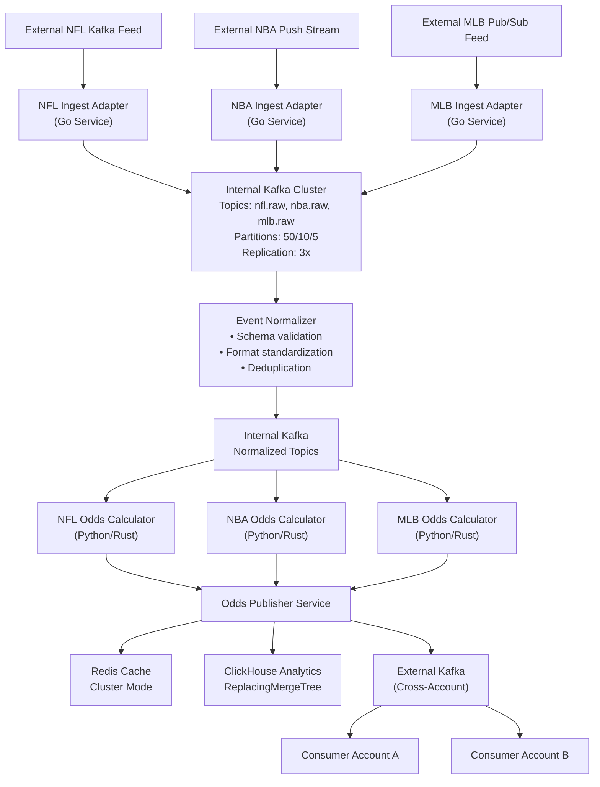

# Real-Time Sports Odds Infrastructure Design

## Sr. Infrastructure Engineer Take-Home Assessment

---

## Executive Summary

This design delivers a cloud-native, event-driven microservices architecture for processing real-time sports odds at scale. The solution ingests diverse feeds (NFL: 300M updates/game, NBA: 400K, MLB: 200K), processes them through containerized services on Amazon EKS, and distributes results via Kafka while storing analytics data in ClickHouse.

**Key Architecture Decisions:**
- **Amazon EKS** for Kubernetes orchestration with multi-AZ deployment
- **Kafka (MSK)** as the core messaging backbone with cross-account streaming
- **ClickHouse** for high-performance analytics storage
- **PostgreSQL + Redis** for operational data and caching
- **Terraform + ArgoCD** for Infrastructure-as-Code and GitOps deployment
- **Grafana/Prometheus/Loki** for unified observability

**Target Performance:**
- 99%+ uptime (100% during games)
- P50: 1-3s, P99: <5s latency
- Peak throughput: 100K+ messages/sec

---

## 1. System Architecture Overview

### Core Architecture Philosophy
Event-driven microservices architecture with sport-specific isolation, enabling independent scaling and fault domains across NFL, NBA, and MLB pipelines.



### Traffic Analysis & Capacity Planning

| Sport | Updates/Game | Peak Rate | Concurrent Games | Total Peak Load |
|-------|--------------|-----------|------------------|-----------------|
| NFL   | 300M         | ~21K/sec  | 4-6 games        | ~125K/sec       |
| NBA   | 400K         | ~55/sec   | 5-8 games        | ~440/sec        |
| MLB   | 200K         | ~18/sec   | 3-5 games        | ~90/sec         |

**System Design Targets:**
- Peak ingestion: 100K+ messages/sec
- Storage: 3TB hot (ClickHouse), 40TB/year cold (S3)
- Retention: 30-90 days hot, 1+ year archived

---

## 2. Infrastructure Foundation

### Cloud Platform & Account Structure
**Amazon Web Services** with dedicated accounts per environment for strong isolation:

```text
Root AWS Organization
├── dev-account (us-east-1)
├── staging-account (us-west-2)  
└── prod-account (us-east-1)
```

Each account contains identical infrastructure topology (VPC, EKS, MSK, RDS, Redis, ClickHouse) with environment-appropriate sizing.

### Kubernetes Platform (Amazon EKS)
- **Managed EKS** for reduced operational overhead and AWS ecosystem integration
- **Multi-AZ deployment** across 3 availability zones for high availability
- **Mixed instance types**: On-demand for critical services, Spot for batch workloads
- **Cluster Autoscaler + HPA** for dynamic scaling based on load and Kafka lag
- **IRSA (IAM Roles for Service Accounts)** for secure AWS service access

### Network Architecture
- **Private subnets** for all services with NAT Gateway for outbound access
- **Security Groups** enforcing least-privilege access per service
- **Transit Gateway** for cross-account Kafka connectivity
- **VPC Flow Logs** integrated with observability stack

---

## 3. Data Pipeline Architecture

### Feed Integration Strategy

| Feed Type | Integration Method | Rationale |
|-----------|-------------------|-----------|
| NFL Kafka | Direct Kafka consumer | Native protocol, highest throughput |
| NBA Push Stream | WebSocket → Kafka adapter | Protocol conversion with minimal latency |
| MLB Pub/Sub | Pull-based poller → Kafka | Reliable polling with backpressure handling |

All adapters normalize external formats to unified Protobuf schema before publishing to internal Kafka topics.

### Processing Pipeline
1. **Ingestion Layer**: Protocol-specific adapters (Go services) convert external feeds to internal Kafka topics
2. **Normalization**: Schema validation, format standardization, and deduplication
3. **Odds Calculation**: Sport-specific processors (Python/Rust) consume normalized events
4. **Publishing**: Unified publisher writes to external Kafka, Redis cache, and ClickHouse

### Data Flow Guarantees
- **Exactly-once processing** via Kafka transactions and idempotent producers
- **Deduplication** using event IDs and ReplacingMergeTree in ClickHouse
- **Backpressure handling** with Redis buffering during traffic spikes
- **Dead Letter Queues** for failed message processing

---

## 4. Data Storage Strategy

### Operational Storage
- **PostgreSQL (RDS Multi-AZ)**: Metadata, configuration, user data
- **Redis (ElastiCache Cluster)**: Real-time odds caching with 5-10s TTL
- **Connection pooling** via RDS Proxy for consistent database performance

### Analytics Platform (ClickHouse)
- **Deployment**: Self-managed on dedicated EC2 instances with NVMe storage
- **Table Structure**: ReplacingMergeTree partitioned by date/sport, sorted by game_id/player_id
- **Data Lifecycle**: 
  - Hot (1-30 days): Fast SSD storage in ClickHouse
  - Cold (30+ days): S3 archival in Parquet format
- **Real-time Ingestion**: Kafka consumers writing directly to ClickHouse with materialized views for aggregations

### Backup & Recovery
- **PostgreSQL**: Daily snapshots + PITR, 30-day retention
- **ClickHouse**: Incremental S3 backups with restore testing
- **Redis**: Daily RDB snapshots (non-critical, can rebuild from source)

---

## 5. Message Streaming & Cross-Account Integration

### Internal Kafka (Amazon MSK)
- **Multi-AZ deployment** with 3-broker minimum for HA
- **Topic partitioning** by game_id for message ordering
- **Replication factor**: 3 with min.insync.replicas=2
- **Performance tuning**: SSD storage, optimized network throughput

### Cross-Account Streaming
- **Connectivity**: AWS PrivateLink for secure cross-account access
- **Authentication**: IAM-based SASL authentication with scoped roles
- **Schema Management**: Confluent Schema Registry with Avro/Protobuf
- **Monitoring**: Producer/consumer lag, delivery latency, error rates

### Exactly-Once Guarantees
- Kafka producers with `enable.idempotence=true`
- Consumer offset commits only after successful downstream writes
- Transactional writes across Kafka + ClickHouse

---

## 6. Observability & Operations

### Unified Monitoring Stack
- **Prometheus**: Metrics collection from all services and infrastructure
- **Grafana**: Single pane of glass with dashboards for engineering, SRE, and business teams
- **Loki**: Log aggregation with structured JSON logs
- **Tempo**: Distributed tracing with OpenTelemetry instrumentation

### Key Metrics & Alerting
- **SLA Monitoring**: P50/P99 latency, uptime per service
- **Business Metrics**: Odds update rate, data freshness, accuracy
- **Infrastructure**: Kafka lag, pod resource usage, database performance
- **Alerting**: PagerDuty integration with tiered escalation

### Dashboards by Audience
- **Engineers**: Service-level CPU/memory, error rates, latency
- **SRE**: System-wide SLA compliance, Kafka health, cluster status
- **Business**: Odds throughput, update freshness, game coverage

---

## 7. Infrastructure as Code & Deployment

### IaC Strategy
- **Terraform + Terragrunt**: Modular infrastructure with environment-specific configurations
- **Directory Structure**: Organized by account → region → component for clean separation
- **Remote State**: S3 backend with DynamoDB locking, separate state per environment
- **Module Versioning**: Reusable modules with semantic versioning

### Application Deployment (GitOps)
- **Helm Charts**: Kubernetes application packaging with environment-specific values
- **ArgoCD**: GitOps-driven deployment with automatic sync from Git repositories
- **CI/CD Pipeline**: GitHub Actions for building, testing, and promoting across environments
- **Rollback Strategy**: Git-based rollbacks with ArgoCD, infrastructure blue/green where applicable

### Environment Management
- **Account Isolation**: Separate AWS accounts prevent cross-environment contamination
- **Configuration**: Environment-specific Helm values and Terraform variables
- **Promotion Flow**: dev → staging → prod with automated testing gates

---

## 8. Security & Compliance

### Access Control
- **AWS IAM**: Least-privilege roles with account-level isolation
- **Kubernetes RBAC**: Namespace-scoped access for development teams
- **Secrets Management**: AWS Secrets Manager with KMS encryption, accessed via IRSA

### Data Protection
- **Encryption**: TLS 1.2+ for data in transit, KMS for data at rest
- **Network Security**: Private subnets, Security Groups, VPC Flow Logs
- **Container Scanning**: Trivy in CI pipeline blocking vulnerable images

### Compliance & Auditing
- **AWS CloudTrail**: All API calls logged and retained
- **Kubernetes Audit Logs**: Pod and API server activity tracking
- **Infrastructure Scanning**: tfsec for Terraform, kube-bench for CIS compliance

---

## 9. Scaling & Cost Optimization

### Autoscaling Strategy
- **Horizontal Pod Autoscaler**: CPU/memory-based scaling for compute services
- **Cluster Autoscaler**: Dynamic node provisioning based on pod demand
- **Kafka Consumer Scaling**: HPA based on consumer lag metrics
- **Custom Metrics**: Scaling based on business metrics (updates/sec, queue depth)

### Cost Management
- **Instance Mix**: 60% on-demand, 40% spot instances for cost efficiency
- **Reserved Capacity**: 1-year RIs for baseline production workloads
- **Resource Optimization**: VPA recommendations, rightsizing based on actual usage
- **Lifecycle Policies**: Automated data archival to reduce storage costs

**Estimated Monthly Cost (Production):**
- EKS + Compute: $2,000
- MSK (Kafka): $3,500  
- RDS PostgreSQL: $800
- Redis: $400
- ClickHouse: $1,200
- Storage (S3): $150
- **Total: ~$8,050/month**

---

## 10. Disaster Recovery & Risk Mitigation

### High Availability Design
- **Multi-AZ deployment** for all stateful services
- **Cross-region backup replication** for critical data
- **Service isolation** by sport to prevent cascading failures
- **Circuit breakers** and retry logic with exponential backoff

### Recovery Objectives
- **RPO (Recovery Point Objective)**: ≤5 minutes for odds data
- **RTO (Recovery Time Objective)**: <15 minutes for component failures, <4 hours for region failover
- **Backup Strategy**: Daily snapshots with automated restore testing

### Failure Scenarios
- **Kafka Consumer Lag**: Autoscaling consumers, alert thresholds
- **Database Failover**: RDS Multi-AZ automatic failover
- **Region Outage**: Cross-region DR with manual promotion
- **Cost Overrun**: Budget alerts, Kubecost monitoring, lifecycle policies

---

## 11. Implementation Roadmap

### Phase 1: Foundation (Weeks 1-2)
- AWS account setup and VPC networking
- EKS cluster deployment with ArgoCD
- Terraform/Terragrunt repository structure
- Basic observability stack (Prometheus, Grafana)

### Phase 2: Core Pipeline (Weeks 3-4)
- MSK Kafka cluster deployment
- PostgreSQL and Redis setup
- NFL ingestion adapter and odds calculator (MVP)
- Internal Kafka topic structure

### Phase 3: Analytics & Expansion (Weeks 5-6)
- ClickHouse deployment and data modeling
- NBA and MLB pipeline extension
- Cross-account Kafka integration
- Load testing and performance tuning

### Phase 4: Production Readiness (Week 7+)
- Security hardening and compliance validation
- Disaster recovery testing
- Performance optimization
- Documentation and runbooks

---

## Key Success Factors

**Technical Excellence:**
- Event-driven architecture ensures loose coupling and scalability
- Multi-AZ deployment provides resilience during peak sporting events
- Kafka-centric design enables real-time processing with replay capabilities

**Operational Maturity:**
- GitOps deployment ensures consistent, auditable infrastructure changes
- Comprehensive observability provides visibility across all system layers
- Automated scaling handles traffic spikes without manual intervention

**Business Alignment:**
- Sport-specific isolation allows independent scaling and failure domains
- Real-time analytics platform enables quantitative research and decision-making
- Cost optimization strategies ensure sustainable growth as volume increases

This architecture provides a solid foundation for processing real-time sports odds at scale while maintaining the flexibility to evolve with changing business requirements and traffic patterns.